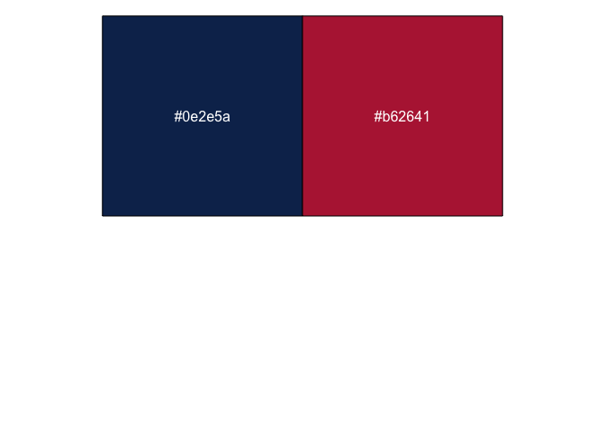

AcademicThemes
================

`AcademicThemes` is a package that provides functionality to allow users
to easily colour plots with the colour palettes of various academic
institutions. Here are two examples of plots that have been recoloured
using colours from the UKRI logo and the Cancer Research UK logo.


This package was made to aesthetically make these plots align with the
logo (and by extension colour theme) of different academic institutions.
**They were not made to be colour blind friendly.** Please be mindful of
people who are colour blind when making your plots and make sure that
all of your figures are as accessible as possible.

## Contributing

Contributions are always welcome. If you would like to add functionality
to `AcademicThemes` please do make a PR request or raise an issue. If
you would like to add a colour palette then you can raise an issue on
GitHub or you can add it yourself. To add a colour palette, fork the
`AcademicThemes` GitHub repository, open `R/colour_palettes.R` and
scroll down to the `academic_colour_palette` function. The colour
palettes are stored at the top of the function in a list

``` r
palettes <- list(
  ...
)
```

To add your own colour palette just add a new entry on this list and
everything else will be done for you. However, the new entry must follow
a certain form. Here is an example of an entry for the Center for
Genomic and Experimental Medicine (CGEM):

``` r
cgem_igc = c("#0e2e5a", "#b62641")
```

`cgem_igc` is the name of the palette. This institute is normally
shortened to CGEM but there are many other institutions that could be
shortened to the same thing. Therefore, `igc` was put on the end of the
name as it is also a part of the Institute of Genetics and Cancer. This
makes `cgem_igc` a much more descriptive and unique palette name.

`c("#0e2e5a", "#b62641")` is a description of the palette itself. These
are the two colours of the CGEM logo stored in HEX.

``` r
library(scales)

show_col(c("#0e2e5a", "#b62641"))
```

<!-- -->

HEX codes are stored as a string starting with a hashtag (`#`) and
followed by six characters that are either numbers 0-9 or letters A-F.
If you don’t write the colours in valid HEX then your addition will fail
when the package is tested and this will result in the palette not being
added to the package. In addition, the palette should be added in
alphabetical order by name to the colour palette list.

If you do the above and submit a pull request then your palette will be
added to `AcademicThemes`, but there are a couple of other things you
can do to make this process easier. After you have added the new palette
you can check that it works by running

``` r
# install.packages("devtools")
devtools::load_all()
academic_colour_palette("<NEW_PALETTE_NAME>")
```

This should return the vector of colours you input. You can then rebuild
the documentation by running

``` r
# install.packages("pkgdown")
devtools::document()
pkgdown::build_site()
```

Finally, you can run the package tests

``` r
devtools::test()
```

This should result in all of your tests passing. If they don’t pass,
check the error message, make sure your new colour palette is written in
valid HEX and make sure you have put it in the right place
alphabetically in the list.

If you would like to be recognised for your contribution then you can
also add yourself as an official contributor. To do so open the file
`DESCRIPTION` and find the lines that read like this

``` r
Authors@R: 
    c(
      person("Hugh", "Warden", , "hugh.warden@outlook.com", role = c("aut", "cre"), comment = c(ORCID = "0000-0002-4308-7316"))
    )
```

To add yourself, add another entry in the vector of authors like this

``` r
Authors@R: 
    c(
      person("Hugh", "Warden", , "hugh.warden@outlook.com", role = c("aut", "cre"), comment = c(ORCID = "0000-0002-4308-7316")),
      person("Joe", "Bloggs", , "", role = c("ctb"), comment = c(ORCID = "1234-5678-1234-5678"))
    )
```

Notice a couple of things. Firstly, this is a vector, so to add a new
entry you have to put a comma after the previous entry (this is easily
forgotten). Secondly, you do not have to supply an email address as
people will not be contacting you about package maintenance. Thirdly,
the role has been changed from `role = c("aut", "cre")` to
`role = c("ctb")`, this means you will be recognised as a
**c**on**t**ri**b**utor to the package (not an **aut**hor or a
**cre**ator). Finally, you don’t have to add an ORCID ID if you don’t
have one, this can be left blank.

If you are reading this, thank you for using and contributing to
`AcademicThemes`.
